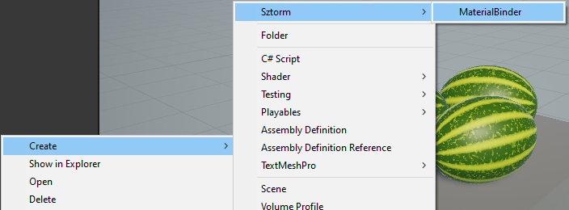
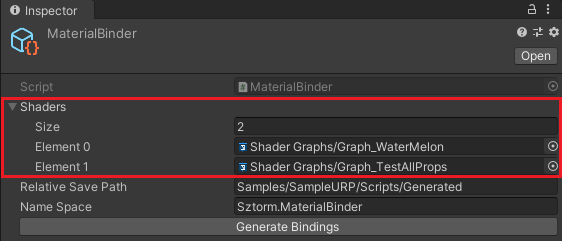
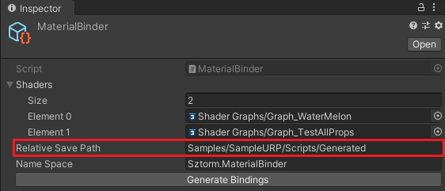
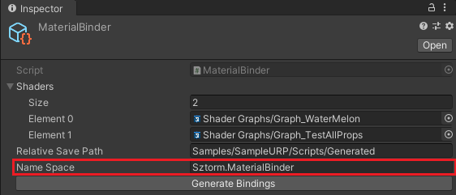
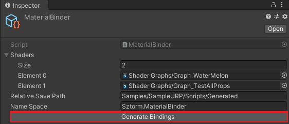

# Documentation

 * [Setting up](#setting-up)
 * [Scripting](#scripting)

## Setting up

**MaterialBinder** must be properly configured before use as it will generate scripts using 
specified shaders, destination and namespace.

 * Create **MaterialBinder** object by pressing RMB and then select 
 **Create** -> **Sztorm** -> **MaterialBinder**

 

 * Set up an array of shaders that will be used to generate material binding scripts.

 

 * Specify relative save path of which the root is the **Assets** folder.
 
 

 * Specify namespace of the generated scripts. Leave this field blank to generate material binding 
 types without a namespace.

 

 * If you made sure that all is configured well, generate scripts by pressing the 
 **Generate Bindings** button.

 

## Scripting

To use the material bindings object, bind adequate material basing on shader name of the material.
Binding wrong material will result in throwing an exception.

```csharp
private SampleShaderMaterialBindings sampleMatBindings;
public Material sampleMaterial;

private void Awake()
{
    sampleMatBindings.Bind(sampleMaterial);
}
```

To stop referencing material by the material bindings object use the **Unbind** method

```csharp
sampleMatBindings.Unbind();
```

The generated material bindings depending on shader may include properties of the following types:

 * [ScalarBinding](#scalarbinding)
 * [VectorBinding](#vectorbinding)
 * [TextureBinding](#texturebinding)
 * [BoolKeywordBinding](#boolkeywordbinding)
 * [EnumKeywordBinding](#enumkeywordbinding)

### ScalarBinding

**ScalarBinding** represents material property binding of a scalar type which can be either 
`float`, `int` or `bool`.

```csharp
bool isWidthDoubled = sampleMatBindings.IsWidthDoubled.AsBool;

if (isWidthDoubled)
{
    float width = sampleMatBindings.Width.AsFloat;
    float doubledWidth = width * 2F;

    sampleMatBindings.Width.Set(doubledWidth);
}
```

### VectorBinding

**VectorBinding** represents material property binding of a vector type which can be either 
`Vector2`, `Vector3`, `Vector4` or `Color`.

```csharp
var tiling = new Vector2(1F, 1F);
var offset = new Vector2(0F, 0F);
var tilingAndOffset = new Vector4(tiling.x, tiling.y, offset.x, offset.y);

sampleMatBindings.TilingAndOffset.Set(tilingAndOffset);
```

### TextureBinding

**TextureBinding** Represents material property binding of a texture type.

```csharp
public Texture albedoMap;
public Texture normalMap;

public void SetTextures()
{
    if (albedoMap != null)
    {
        sampleMatBindings.AlbedoMap.Set(albedoMap);
    }
    if (normalMap != null)
    {
        sampleMatBindings.NormalMap.Set(normalMap);
    }
}
```

### BoolKeywordBinding

**BoolKeywordBinding**

### EnumKeywordBinding

**EnumKeywordBinding**