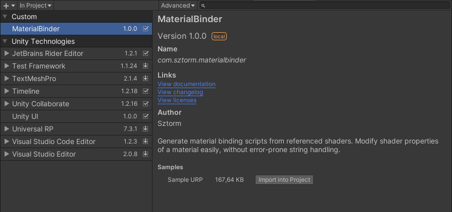

# MaterialBinder
A code generation tool which simplifies and reduces errors associated with material binding 
process in Unity Engine.

 * [Documentation](Documentation/MaterialBinder.md)
 * [Changelog](CHANGELOG.md)
 * [Description](Description)
 * [Requirements](Requirements)
 * [Installation](Installation)
 * [License](LICENSE.md)

## Description

**MaterialBinder** is a scriptable object which takes references of shaders given by user to 
generate material binding scripts that limit work needed to use the material with specified
shader in scripts. Generated material binding types are easy to use and saves user from typing 
shader variable names, thus reducing possible errors.

See [documentation](Documentation/MaterialBinder.md) to learn how to use the **MaterialBinder**.

The package is UPM-ready and also provides other options of installation.

## Requirements

No special requirements are required. Package is tested and works in Unity 2019.4.28f1, however 
**MaterialBinder** may work in newer as well as in older Unity versions.

## Installation

There are many options of installation of this tool including:

1. Install MaterialBinder using Unity Package Manager (recommended)
2. Download release unitypackage and import it to your project
3. Download source files and drop them into to your project

1.
 * Select **Window** -> **Windows** -> **Package Manager**

 

 * Press **+** button and then select **Add package from git URL...** option

 

 * Paste `` https://github.com/Sztorm/MaterialBinder.git `` into text input and press **Add**

 

 * That's it. The package is ready to use.

 

2.
 * Download release unitypackage from the **Releases** section on GitHub (Select desired version)
 * Click **Assets** folder using RMB and then select **Import Package** -> **Custom Package...**

 

3.
 * Download source files .zip archive from GitHub.
 * Unpack contents into folder of choice which is child of the **Assets** folder

## License
**MaterialBinder** is licensed under the MIT license. **MaterialBinder** is free for 
commercial and non-commercial use.

[More about license.](LICENSE.md)